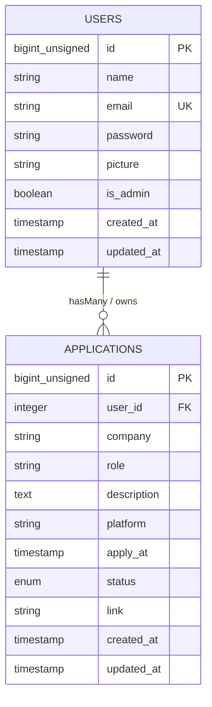

# SchemaJobTracker.md - Spesifikasi Skema Basis Data Job Tracker System

Dokumentasi resmi struktur skema basis data (*Database Schema*), tabel, kolom, tipe data, atribut, kunci utama (*Primary Key*), kunci asing (*Foreign Key*), serta relasi antar tabel pada proyek **Job Tracker Sistem**.

---

## 🗄️ Ringkasan Struktur Tabel

Aplikasi ini menggunakan basis data relasional (MySQL / MariaDB) dengan tabel-tabel utama berikut:

| Nama Tabel | Deskripsi | Jumlah Kolom |
| :--- | :--- | :---: |
| [`users`](#1-tabel-users) | Menyimpan data akun pengguna (Admin & Pelamar/User). | 7 |
| [`applications`](#2-tabel-applications) | Menyimpan data catatan lamaran pekerjaan pengguna. | 10 |
| [`personal_access_tokens`](#3-tabel-personal_access_tokens) | Menyimpan token autentikasi API Laravel Sanctum. | 10 |

---

## 📐 Detail Skema Tabel

### 1. Tabel `users`
Tabel ini digunakan untuk menyimpan seluruh informasi akun pengguna sistem, baik yang memiliki hak akses sebagai Administrator maupun Pelamar Kerja biasa.

- **Nama Tabel**: `users`
- **Model Eloquent**: `App\Models\User`
- **Migration**: `2014_10_12_000000_create_users_table.php`

#### Struktur Kolom:

| Nama Kolom | Tipe Data | Nullable | Default | Keterangan / Proteksi |
| :--- | :--- | :---: | :--- | :--- |
| `id` | `BIGINT UNSIGNED` | ❌ No | *Auto Increment* | **Primary Key** |
| `name` | `VARCHAR(255)` | ❌ No | - | Nama lengkap pengguna |
| `email` | `VARCHAR(255)` | ❌ No | - | **Unique Index**, Alamat email aktif / username login |
| `password` | `VARCHAR(255)` | ❌ No | - | Password terenkripsi (*Bcrypt Hash*) |
| `picture` | `VARCHAR(128)` | ❌ No | `'user.jpg'` | Nama berkas foto profil pengguna |
| `is_admin` | `TINYINT(1)` | ❌ No | `0` | Peran pengguna: `1` (Admin), `0` (User/Pelamar) |
| `created_at` | `TIMESTAMP` | 🟢 Yes | `NULL` | Waktu pendaftaran akun |
| `updated_at` | `TIMESTAMP` | 🟢 Yes | `NULL` | Waktu pembaruan akun terakhir |

---

### 2. Tabel `applications`
Tabel utama untuk mencatat setiap data aktivitas lamaran pekerjaan yang diajukan oleh pengguna pelamar.

- **Nama Tabel**: `applications`
- **Model Eloquent**: `App\Models\Application`
- **Migration**: `2024_01_03_053823_create_applications_table.php`

#### Struktur Kolom:

| Nama Kolom | Tipe Data | Nullable | Default | Keterangan / Proteksi |
| :--- | :--- | :---: | :--- | :--- |
| `id` | `BIGINT UNSIGNED` | ❌ No | *Auto Increment* | **Primary Key** |
| `user_id` | `INTEGER` | ❌ No | - | **Foreign Key** me-refer ke `users.id` |
| `company` | `VARCHAR(50)` | ❌ No | - | Nama perusahaan yang dilamar |
| `role` | `VARCHAR(25)` | ❌ No | - | Nama posisi / jabatan pekerjaan |
| `description` | `TEXT` | ❌ No | - | Rincian kualifikasi & deskripsi pekerjaan |
| `platform` | `VARCHAR(25)` | ❌ No | - | Platform pelamaran (LinkedIn, Glints, JobStreet, Indeed, Pintarnya, E-Krut) |
| `apply_at` | `TIMESTAMP` | ❌ No | - | Tanggal & waktu pelamaran dilakukan |
| `status` | `ENUM` | ❌ No | - | Status lamaran: `'Send CV'`, `'Viewed'`, `'Interview HRD'`, `'Interview User'`, `'Success'`, `'Failed'` |
| `link` | `VARCHAR(128)` | 🟢 Yes | `NULL` | Tautan eksternal / URL lowongan pekerjaan |
| `created_at` | `TIMESTAMP` | 🟢 Yes | `NULL` | Waktu entri data dibuat |
| `updated_at` | `TIMESTAMP` | 🟢 Yes | `NULL` | Waktu data diperbarui terakhir |

---

### 3. Tabel `personal_access_tokens`
Tabel bawaan Laravel Sanctum untuk mengelola token sesi API apabila diperlukan akses mobile atau layanan pihak ketiga.

- **Nama Tabel**: `personal_access_tokens`
- **Migration**: `2019_12_14_000001_create_personal_access_tokens_table.php`

#### Struktur Kolom:

| Nama Kolom | Tipe Data | Nullable | Default | Keterangan / Proteksi |
| :--- | :--- | :---: | :--- | :--- |
| `id` | `BIGINT UNSIGNED` | ❌ No | *Auto Increment* | **Primary Key** |
| `tokenable_type` | `VARCHAR(255)` | ❌ No | - | Nama kelas entitas (Polymorphic) |
| `tokenable_id` | `BIGINT UNSIGNED` | ❌ No | - | ID entitas pengguna (Polymorphic Index) |
| `name` | `VARCHAR(255)` | ❌ No | - | Nama identifikasi token |
| `token` | `VARCHAR(64)` | ❌ No | - | **Unique Index**, Hashing token rahasia |
| `abilities` | `TEXT` | 🟢 Yes | `NULL` | Hak akses / kemampuan token |
| `last_used_at` | `TIMESTAMP` | 🟢 Yes | `NULL` | Waktu penggunaan token terakhir |
| `expires_at` | `TIMESTAMP` | 🟢 Yes | `NULL` | Waktu kadaluarsa token |
| `created_at` | `TIMESTAMP` | 🟢 Yes | `NULL` | Waktu pembuatan token |
| `updated_at` | `TIMESTAMP` | 🟢 Yes | `NULL` | Waktu pembaruan token |

---

## 🔗 Diagram Relasi Antar Tabel (Entity Relationship Diagram)

### Penjelasan Relasi:
- **`users` -> `applications` (One-to-Many / 1:N)**:
  - Satu pengguna (`User`) dapat memiliki **banyak** catatan lamaran pekerjaan (`Application`).
  - Setiap catatan lamaran pekerjaan (`Application`) dimiliki oleh tepat **satu** pengguna (`User`) via `user_id`.
  - Terhubung dalam Eloquent Model:
    - `User::hasMany(Application::class, 'user_id')`
    - `Application::belongsTo(User::class, 'user_id')`
